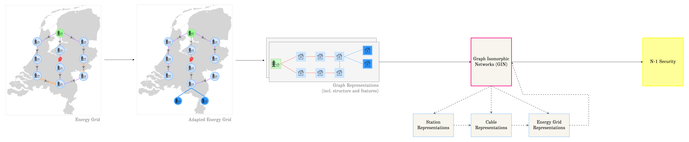
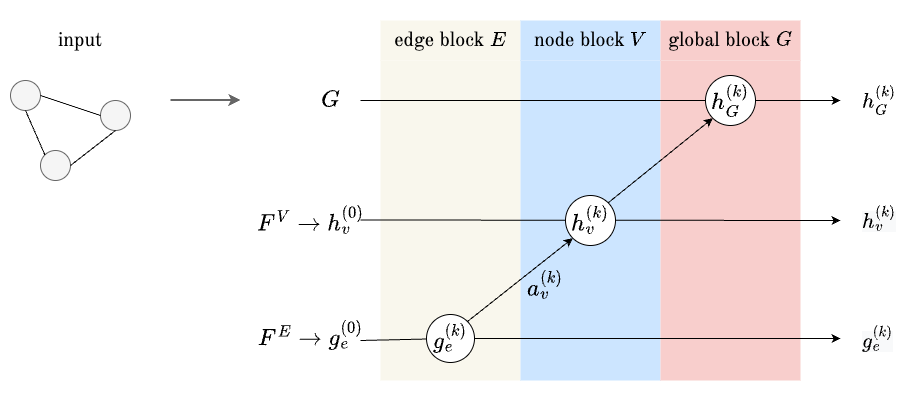
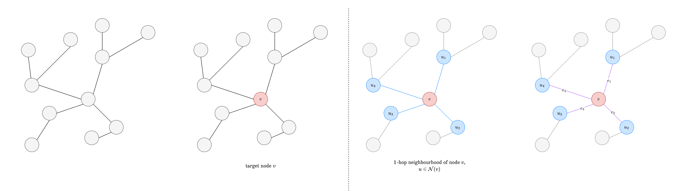
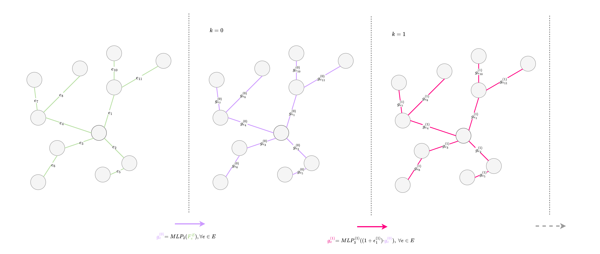
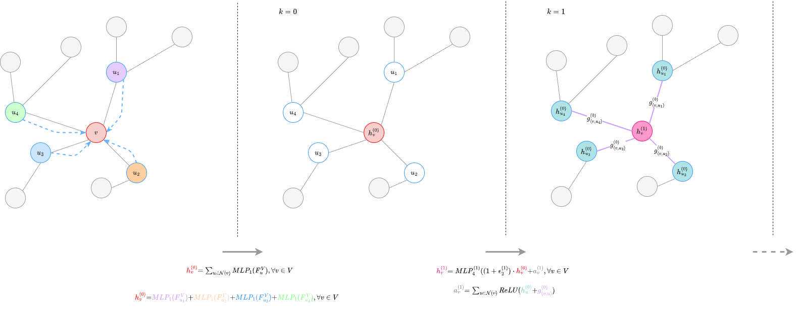

In progress: hyperparameter tuning, network architecture options (e.g., opt out edge features, gnn layer options), and data augmentations.

Extensions: 

# GINenergygrids

Code related to our [paper](https://arxiv.org/abs/2310.01181): "Graph Isomorphic Networks for Assessing Reliability of the Medium-Voltage Grid." by Cambier van Nooten, C., van de Poll, T., Füllhase, S., Heres, J., Heskes, T., & Shapovalova, Y. 

Graph Isomorphic Networks for assessing the N-1 principle on energy grids. Case study on a medium-voltage grid of a Distribution System Operator (DSO) in the Netherlands (Alliander). 

Disclaimer : This code demonstrates the main algorithm (GIN) in a barebone manner. Please contact us if there are any questions.

## Datasets
Real grid data (obtained from Alliander, DSO in the Netherlands) together with augmented data.

## GIN framework 

###  GIN layer details (supplementary material)
See the figures below for complementary illustrations of the GIN equations mentioned in the paper.

Fig 1. Overview of a single GIN block, example includes as input the first layer of embeddings ($k=0$), and results in the second layer of embeddings ($k=1$).

Fig 2. Representation of an example graph $G$ (1-hop neighbourhood), with target node $v$, highlighted in red.  All neighbouring nodes $u$ of $v$, $u \in \mathcal{N}(v)$, highlighted in blue. The edges ($e$) included in this neighbourhood are highlighted in purple.

Fig 3. Apply the first MLPs in the first layer ($k=0$), for the edges. Update the embeddings using the previous layer.

Fig 4. Apply the first MLPs in the first layer ($k=0$). Apply aggregation (and combining in the second layer ($k=1$), for both the nodes and edges. For simplification, only the 1-hop neighbourhood of node $v$ is considered. In the real method, we considered these steps for all nodes and edges.

## Training 
Create virtual environment

``
virtualenv ENV -p python3
source ENV/bin/activate
``

Install requirements

``
pip install -r requirements
``

