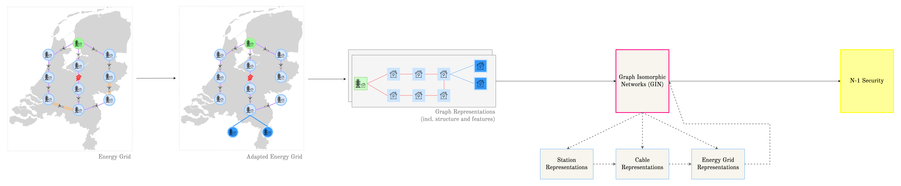
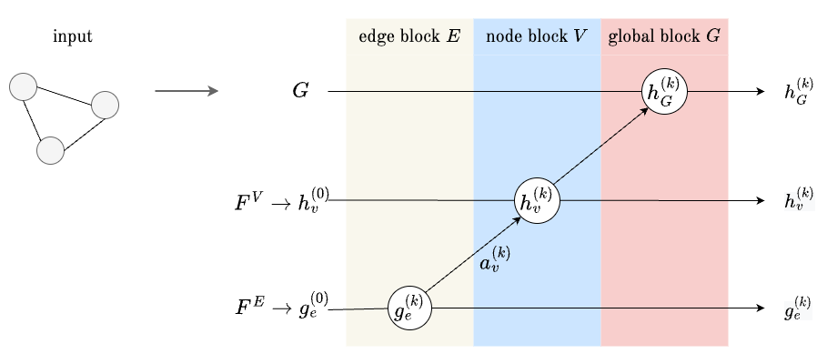
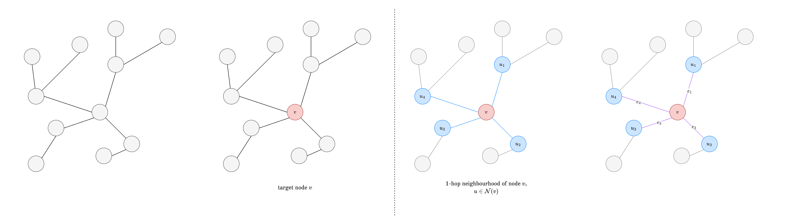
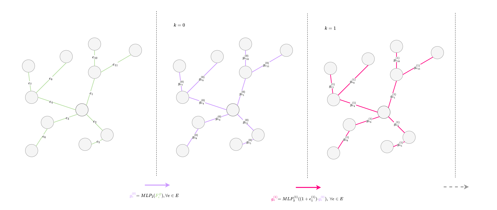
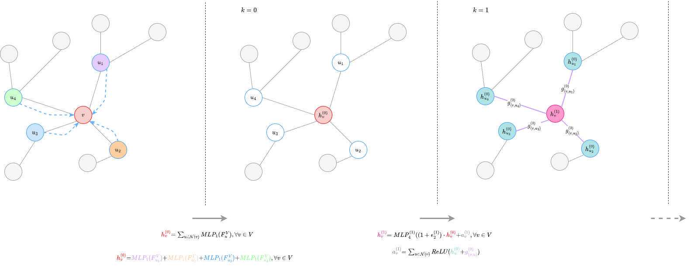

# GINenergygrids

Graph Neural Networks for assessing the N-1 principle on energy grids. Case study on a medium-voltage grid of a DSO (Alliander). Created as part of my PhD at Radboud University and AI for Energy Grids Lab.
This repository demonstrates the main algorithm in a barebone manner.

See figure below for further complementaty illustrative examples for the GIN equations mentioned in the paper.

Fig 1. Overview of a single GIN block, example includes as input the first layer of embeddings ($k=0$), and results in the second layer of embeddings ($k=1$).

Fig 2. Representation of an example graph $G$ (1-hop nieghbourhood), with target node $v$, highlighted in red.  All neighbouring nodes $u$ of $v$, $u \in \mathcal{N}(v)$, highlighted in blue. The edges ($e$) included in this neighbourhood are highlighted in purple.

Fig 3. Apply the first MLPs in the first layer ($k=0$), for the edges. Update the embeddings using the previous layer.

Fig 4. Apply the first MLPs in the first layer ($k=0$). Apply aggregation (and combining in the second layer ($k=1$), for both the nodes and edges. For simplification, only the 1-hop neighbourhood of node $v$ is considered. In the real method, we considered these steps for all nodes and edges.

